## Okay, so what actually happened?

This one is a bit different from the usual portfolio stuff. It's about **Needlelight**, formerly known as **LumaflyV2**, and the entire mess that came with it. I have wanted to write this for a while, mostly because whenever I look back at the old screenshots I go, _bro, what was I even doing?_

This is not a hate post, and I am not writing this so people can go attack anyone. I have genuinely moved on from this whole thing. I just want to explain what happened from **my side**, in chronological order, including the parts where I was absolutely wrong, the parts where the criticism was fair, and the parts where I think some people went way too far.

Also, yes, I am attaching the screenshots throughout the blog. I think that is the fairest way to do this. I am not going to throw a bunch of claims at you and then say "trust me bro". The screenshots are there, the old GitHub history is there, and the current [Needlelight repository](https://github.com/Aarav2709/Needlelight) is there too.

And yeah, while going through all of this again to write the blog, I genuinely got chills a few times. Not because I am still angry about it, but because it is kinda insane to look at something I did at 14 and realise how much has changed since then.

## First things first, I was 14

This is probably the most important bit of context in the entire story. I was **14 years old** when I started this project. I was learning programming, getting into open source, playing Hollow Knight, waiting for Silksong like everyone else, and I thought it would be really cool to make a launcher for Silksong modding.

That was genuinely the thought process. I saw [Lumafly](https://github.com/TheMulhima/Lumafly), saw what a mod manager could do, and basically went, "why don't I make one for Silksong?" I did not realise that the Silksong modding ecosystem at the time was nowhere near mature enough for what I wanted. I also did not realise just how much community context existed around Lumafly and how careful you have to be when working around an established open source project.

I knew some C#. I knew enough GitHub to make repositories and commits. I knew how to get an application to run. What I did **not** know was open source etiquette, community expectations, licensing beyond the surface level, or how important communication was.

So yeah. I was dumb. Not malicious, just inexperienced and very excited to build something.

## September 2025, the LumaflyV2 era begins

I originally forked Lumafly because I wanted to experiment with the existing launcher and adapt it towards Silksong. The repository still visibly has that fork lineage today, and I am not trying to hide it. I made a few commits, changed things around, and then renamed the project to **LumaflyV2**.

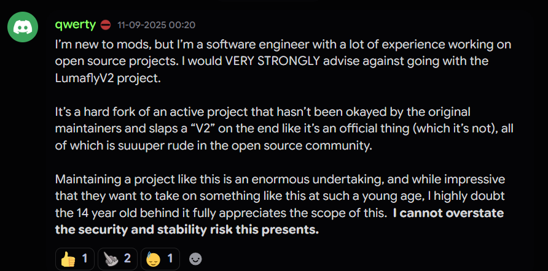

Looking back, the **name** was one of my biggest mistakes. Calling it LumaflyV2 made it sound like an official sequel or a proper continuation of Lumafly. It was not. It was a rough fork made by a 14 year old who was trying to adapt it for an ecosystem that was not really there yet.

The early project did not work properly either. It was mostly me changing things, breaking things, fixing some things, asking AI why something was broken, trying the fix, breaking something else, and repeating the cycle. I had much less C# knowledge back then, so a lot of the work was honestly me learning by doing, except I was doing it in public lol.

There were already discussions around whether a proper Silksong launcher even made sense at that point. The ecosystem had very little mature support compared to what exists now.

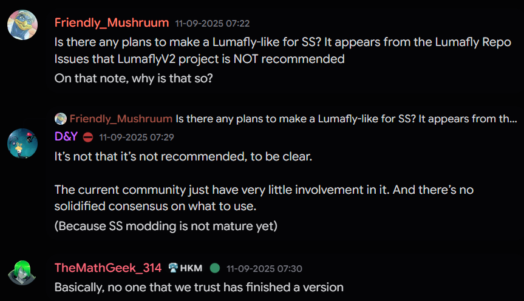

And honestly, that criticism was fair. I just did not understand it yet.

## Then PR #1 happened

This is where the whole thing started becoming much bigger than I expected. People started questioning the relationship between Lumafly and LumaflyV2, and eventually a pull request called **"Clarify relationship to Lumafly in the README"** was opened.

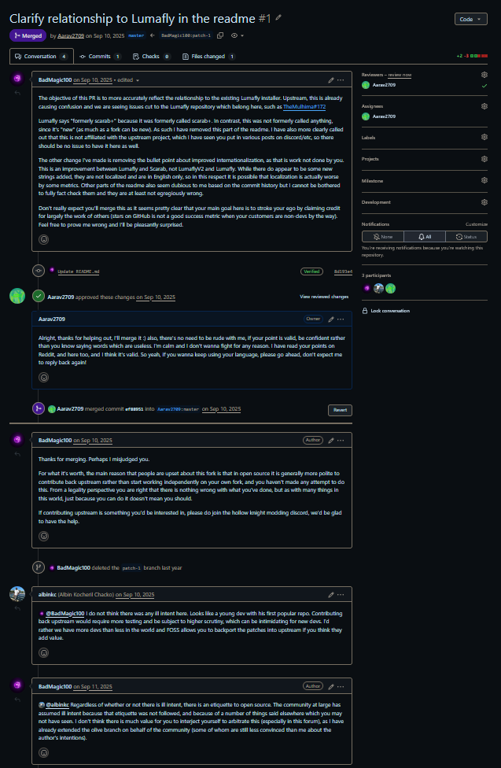

I agreed with the main point. My README should absolutely have been clearer. I should not have used the name LumaflyV2 in the first place, and I should have made it extremely obvious that I was not affiliated with the Lumafly maintainers.

I also had not contacted the maintainers before starting the fork. That was another mistake. I knew the repository was GPLv3 licensed and understood that I was allowed to fork it under the license, but I did not understand that **"the license allows me to do this"** and **"I should probably communicate with the people involved before doing this"** are two very different things.

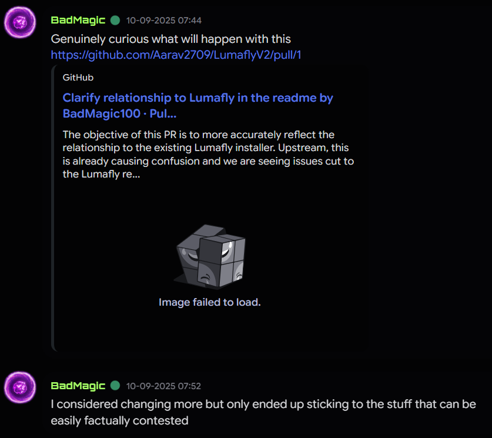

That is something I absolutely would handle differently today.

## The attribution and art problem

There was also criticism about attribution, and this one is another place where I genuinely made a mistake. I used one or two images that I found randomly through Google while working on the branding. The accounts behind them were anonymous usernames, and I did not preserve the original links properly.

I **did** credit the developers and projects I was actually referencing, and there was no secret plan to pass other people's work off as mine. But I still should have handled those images properly. I should have linked the original posts, used clearly licensed assets, or just made the assets myself.

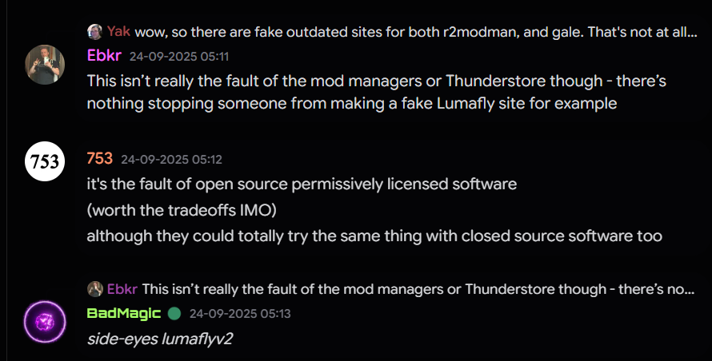

So yes, that criticism is fair. It was a stupid oversight, and I own it.

## The AI accusations, lol

:::margin
This is probably the part where I get accused of writing this blog with AI because I am talking about AI. xD
:::

During the early C# versions, I used AI **a lot more** than I do now. I simply had less knowledge. When I got stuck on a bug or did not understand why something was happening, I would ask AI for help. Sometimes it would generate code, sometimes it would explain the issue, sometimes it would give me a fix that I then had to debug because, well, AI is AI.

That is completely true.

What I do not agree with is turning that into "the entire project was AI slop" or "the developer did nothing". Most of the project was still me writing, changing, testing, and understanding the code. I reviewed what I committed. I learned from the fixes. The project was not some magic button where I typed a prompt and got a working launcher.

The early versions were bad in places. They were also genuinely mine.

And yes, I still use AI today. I use it for brainstorming, debugging, and fixing the occasional bug where I am stuck. I do not use it as a substitute for understanding my own code.

That difference matters a lot to me, especially because the current version is a **ground up rewrite** written by me.

## The stars thing was also my fault

Okay, here is another one where I am not even going to defend myself.

**Yes, I asked people to star the repository.**

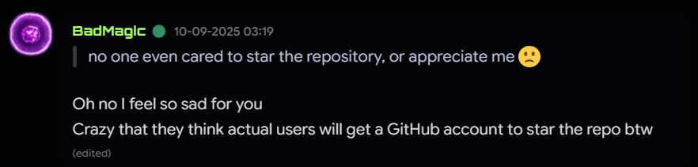

That was dumb. I was 14, I wanted people to notice what I had made, and I was treating GitHub stars like some kind of score. I should not have done that.

But there is an important difference between **asking people to star my project because I was a dumb teenager** and **building the project purely for star farming**. I did the first one. I did not do the second one.

I actually cared about making the launcher. I was just very bad at separating that from wanting people to notice it.

## The part that genuinely hurt

This is where the screenshots get difficult for me to look at.

There were people who were actually pretty reasonable about the whole thing. Some people pointed out that my actions made more sense when you considered that I was a 14 year old with very little open source experience.

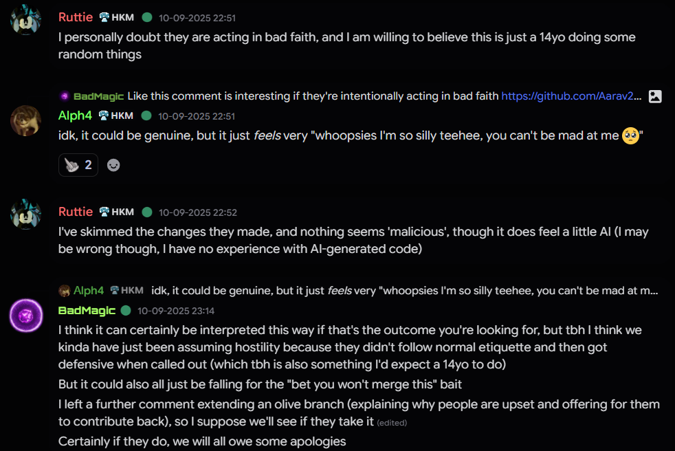

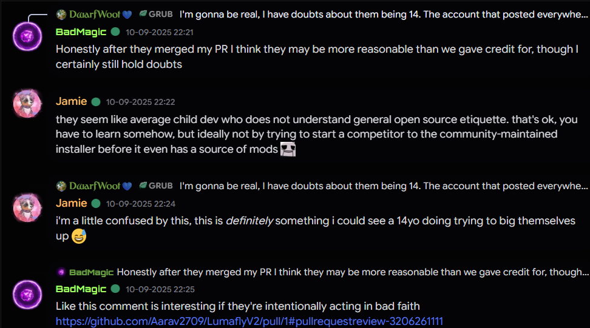

And then there were comments that were considerably harsher.

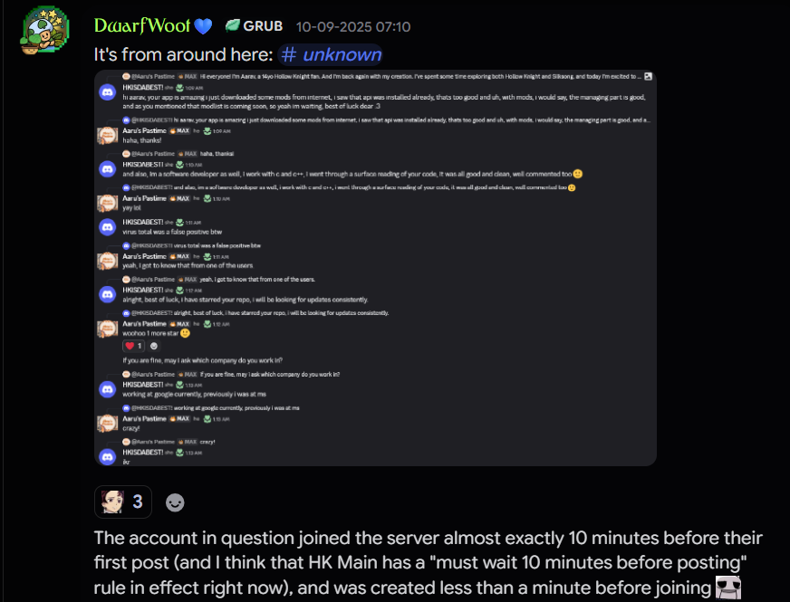

People questioned my age, questioned whether I was actually a kid, made jokes about it, and generally treated the fact that I was 14 as another reason to distrust everything I had done.

There was even a discussion involving my Roblox Game Development certification.

There were also people speculating about my social accounts and whether some of them were fake.

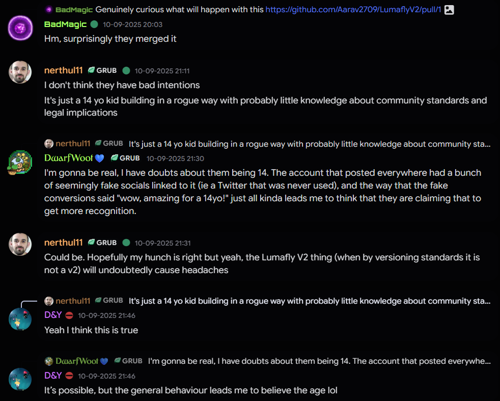

And some comments were just straight up insulting.

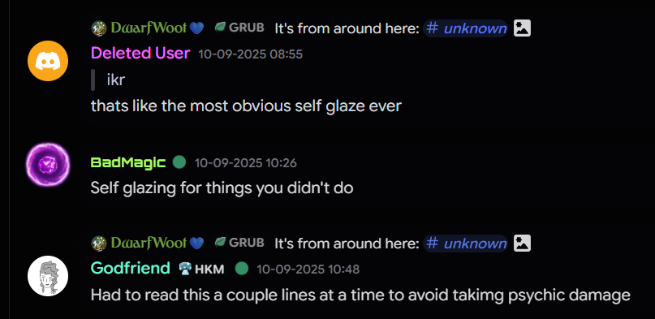

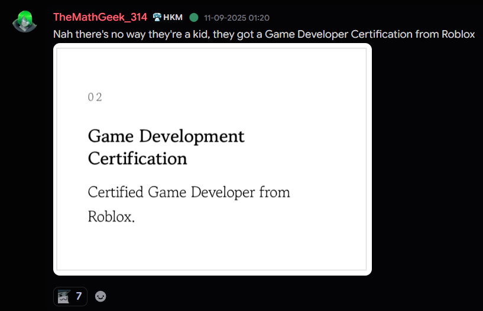

I want to be careful with how I say this because I am not trying to play the victim card. I really did make mistakes. I deserved criticism for those mistakes.

But going through these screenshots now, knowing that I was literally **14**, gave me chills. Some of the people involved were grown adults talking about a teenager as though I had some giant malicious plan to take over a community.

I did not.

I was a kid who made a bad project, gave it a bad name, communicated badly, and had basically no idea what the community expected from me.

That is not an excuse for what I did. It is just the actual context.

## Renaming it to Needlelight did not magically fix anything

Eventually I realised that the LumaflyV2 name was simply not worth keeping, so I renamed the project to **Needlelight**.

And just to make this extremely clear because I have seen this get confused before: **Needlelight and LumaflyV2 are the same project.** Needlelight is the result of that project being renamed and later rebuilt.

There was also a project called **Silkfly**, but that was someone else's project. Silkfly was not me, and Silkfly was not Needlelight.

At this stage, Needlelight was still rough. It did not suddenly become good because the logo changed. The launcher still had bugs, Silksong support still did not make sense in the way I wanted, and I was still learning a ton.

Basically, new name, same problems. :D

## February 2026, somehow we are still talking about this

The controversy did not really die when the original discussion ended. A few months later, people were still revisiting it and explaining why they thought the project was problematic.

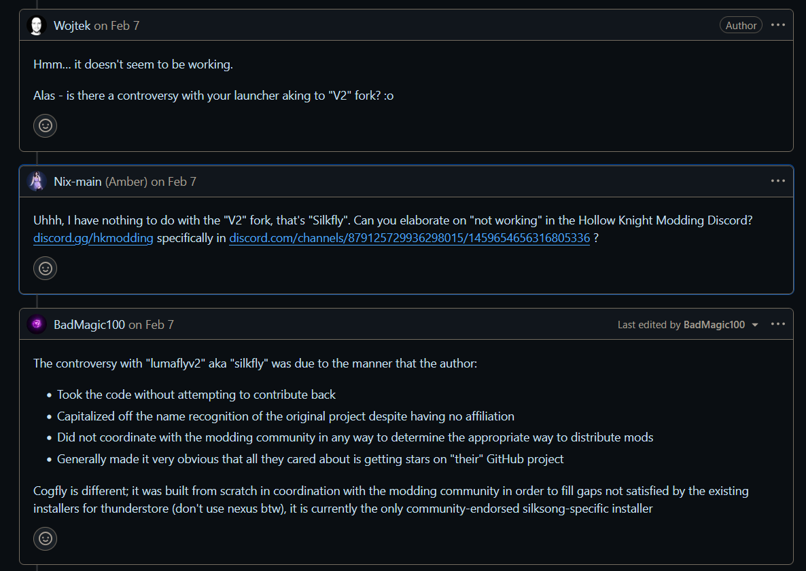

There were posts saying that the project should be clearly marked as unrelated to Lumafly, and discussions about whether people should use it at all.

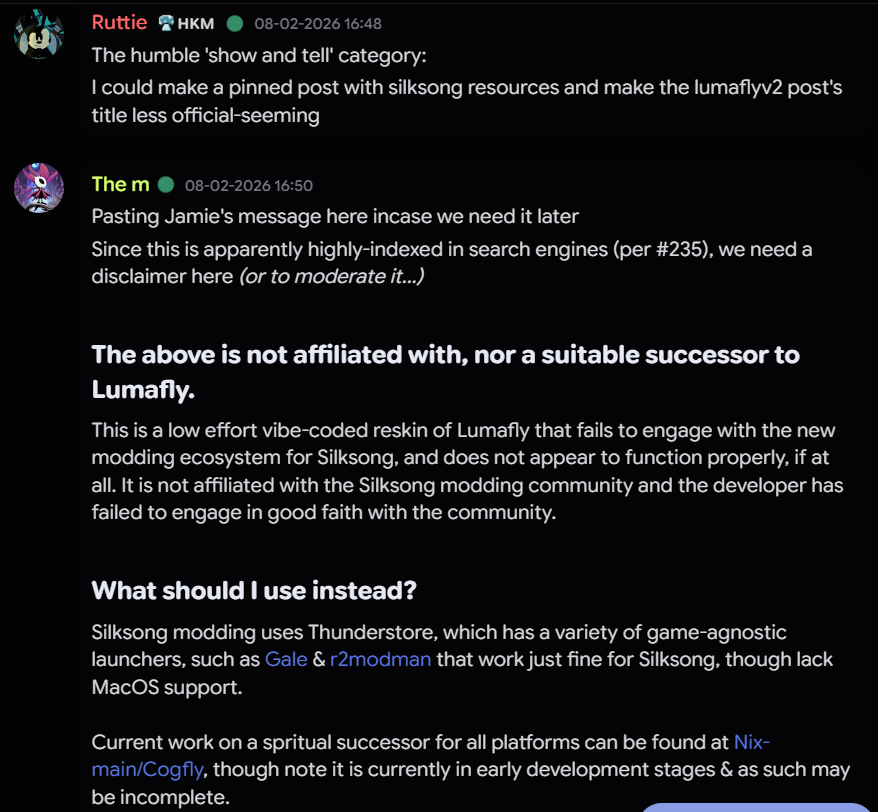

There was even a pretty direct recommendation telling people not to use Needlelight.

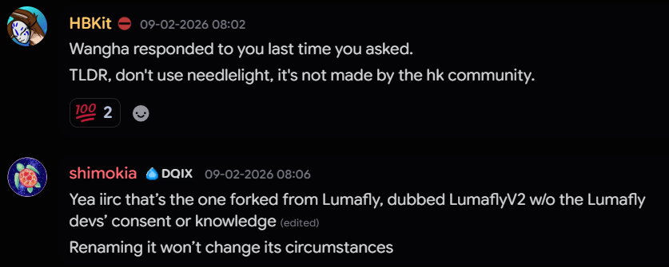

By this point, arguing online was not helping me make the project any better. So I started focusing on the actual software instead.

## And yes, there were real bugs

One of the support issues was basically the old project doing exactly what people said it did. It had trouble installing mods and identifying the Hollow Knight executable correctly.

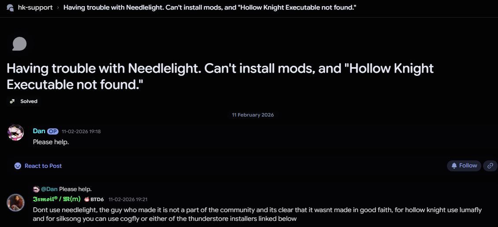

This screenshot is actually one of the more useful ones in hindsight because it reminds me that the criticism was not all made up. The old project **was buggy**. It was not the finished launcher I wanted it to be.

Instead of getting mad every time someone pointed out a bug, I eventually started doing the much more useful thing and fixing them.

That was the point where my mindset really started changing.

## Cogfly enters the story more prominently

Around this time, **Nix**, the developer of [Cogfly](https://github.com/Nix-main/Cogfly), became a much more visible part of the discussion.

First of all, I think Cogfly itself is a good launcher. I am not going to pretend otherwise just because I disagree with things its developer said about my project.

The part I had a problem with was the way Needlelight was sometimes described, especially the repeated framing of it as AI slop, star farming, or something that was not worth taking seriously.

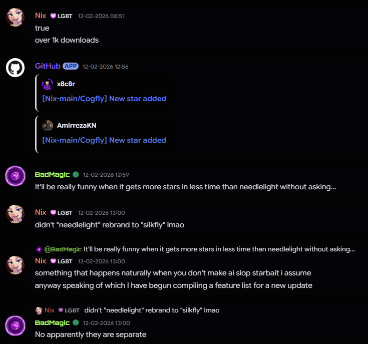

There were also comments about how great it would be when Cogfly eventually passed Needlelight in stars, and Nix later said she would be happy about that happening.

Congrats, genuinely. Cogfly has done well. The modding community might still hate me for writing this blog and stuff, but issokay. I think Cogfly is a good launcher, and I am happy for Nix.

But I am going to be a little ironic here because I cannot help myself. If Needlelight was just "slop" made to farm stars, then I am not really sure why the number of stars on it became something worth celebrating when Cogfly passed it. lolol.

My own project went from around **40 stars to 62 stars without me promoting it**, and that is something I am proud of. Not because 62 is some massive number, but because those are 62 people who apparently thought, "yeah, I like this thing enough to click a button." 

Cogfly is definitely gonna have more popularity cause' its actually showcased by the bots, the people and stuff in a HK Modding Server which has literally over 80k Members, so even if it gets like 50k Stars, then also I would be happy with my 62 stars (at the time of writing) cause I haven't made a single post about this thing, and neither would I promote it anywhere. I think traction can be gained by itself, not something I need to promote. Ahahaha!

GitHub stars are not a leaderboard anyway. I learned that lesson the hard way.

## The SmartScreen problem was real. The malware claim was not.

There was another concern that kept coming up: Windows Defender and SmartScreen.

Yes, Needlelight did trigger warnings for some people. That part was real.

The reason was not that I had hidden malware inside the launcher. I was not financially capable of paying for executable signing and building up the reputation associated with properly signed software, so the Windows warning was unfortunately something I had to deal with.

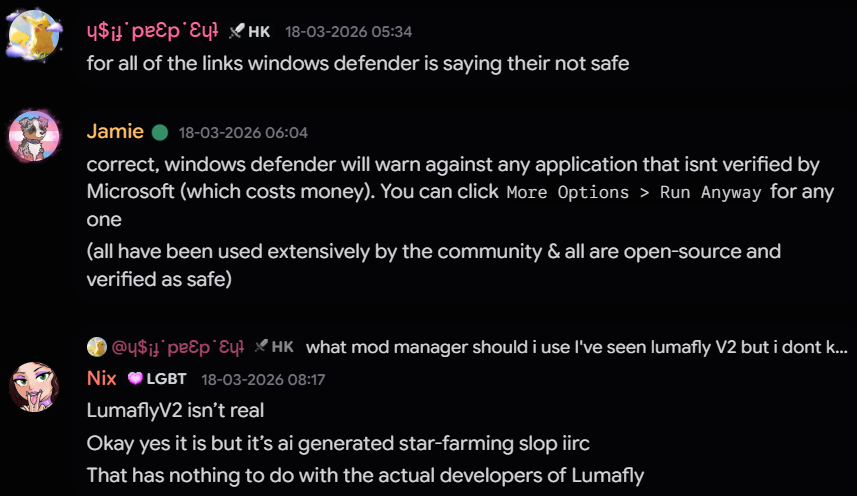

But **a SmartScreen warning is not the same thing as malware**, and there has never been malicious behaviour hiding inside Needlelight.

The source code is public, the Git history is public, and the current project history is still there. I would rather people inspect the code than just blindly trust me because I said so.

The SmartScreen issue is still something I would like to solve properly. If I find a legitimate free way to improve signing and reputation, I will absolutely use it.

## The big rewrite finally starts

This is where Needlelight stops being the same thing people were arguing about in the old screenshots.

I had learned a lot more about programming by this point, and I had also started getting much more comfortable with **Rust and Tauri**. I realised that instead of trying to keep patching the old launcher, I could just build the launcher I actually wanted.

So that is what I did.

I started working on **v8.0.0.0**, a ground up rewrite.

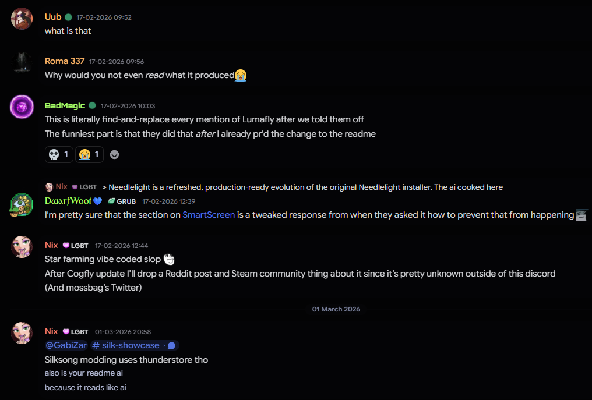

The current codebase is built with **Tauri, Rust, and Vue**. The Rust side handles the native desktop functionality, filesystem operations, game detection, profiles, mod installation, configuration, and the other parts that need to talk directly to the user's system.

The frontend uses parts of [Modrinth's Theseus launcher project](https://github.com/modrinth/code). I contacted the Modrinth team myself and got permission to use their open source frontend work. I also clearly documented that usage in the repository.

I am not hiding that. Why would I? Open source is literally about being open.

The frontend started from that base, but I iterated it heavily, stripped out things that were unnecessary for my project, and built the actual Needlelight experience around it.

So no, it is not "Modrinth copied into Needlelight" either. It is a frontend base that I was explicitly allowed to use and then adapted for what I needed.

## April and July 2026, the project keeps moving

Even while the rewrite was happening, people were still discussing the old controversy. There were new arguments about stars, whether Needlelight had already peaked, whether the launcher was actually useful, whether its frontend was copied, whether the project was AI generated, and whether its mod source handling made sense.

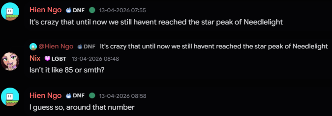

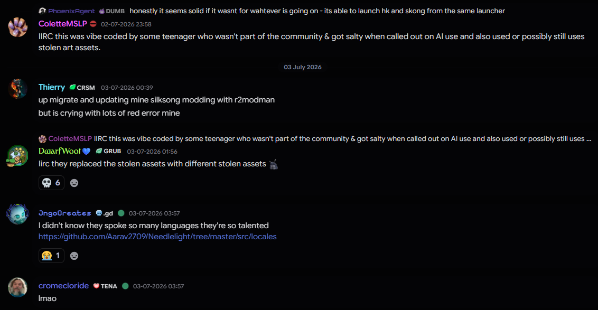

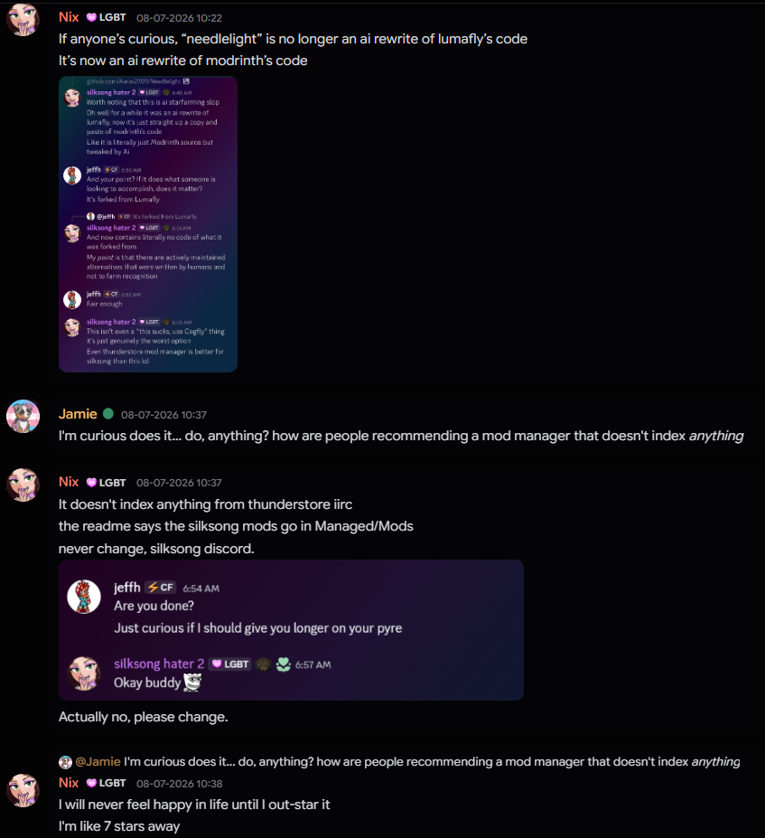

The funny thing is that by then I was not really building around the arguments anymore. I was building around the software.

That is a pretty big difference.

## September 11, 2026. Finally.

Yesterday, on **11 September 2026**, I released **Needlelight v8.0.0.0**.

And yeah, I am feeling so ironic while typing this lolol, but [finally, v8.0.0.0 is out!](https://github.com/Aarav2709/Needlelight/releases/tag/v8.0.0.0) xdd. At least I can promote it on my own blog now. Otherwise they, ifkykyk, the modding community, would be upset. Yo community, if you're reading this, **that is a joke lol**.

Almost one year after the whole thing began. Around seven months of genuinely pouring my heart and soul into rebuilding it. And now I actually have a launcher that works the way I originally wanted it to.

## So what is Needlelight now?

The easiest way to describe it is pretty simple: **Needlelight is now my own launcher.**

The old project started from a Lumafly fork. The current implementation does not use the old Lumafly implementation as runtime code. The repository is still a GitHub fork and still carries that lineage, but the application itself has been rewritten from the ground up.

Today, Needlelight supports both **Hollow Knight** and **Hollow Knight: Silksong** with separate game profiles. It can browse mods, install and manage mods, handle the required modding APIs, switch between modded and vanilla setups, support custom ModLinks catalogs, and manage the game specific paths for both games.

It also works across **Windows, macOS, and Linux**. And this is the part that makes teenage me laugh a little. I originally started the project because I wanted Silksong mod support. It did not work properly. I got clowned on. I spent the next year learning how to actually build the thing. And now it actually does what I wanted. Big W for me chat xD.

## The current numbers

As I write this, Needlelight has around **15,000 downloads**, **62 GitHub stars**, and I am still the **sole contributor**. I am not going to pretend that those numbers are gigantic. They are not.

But when I remember that this started as a broken experimental fork made by a clueless 14 year old, I think they are pretty cool. More importantly, the project works. That matters much more to me now than a star counter ever could.

## Okay, but was the criticism justified?

Yea, definitely. Here is what I will happily own:

1. I used the name `LumaflyV2`, and that was confusing.
2. I did not contact the Lumafly maintainers before starting the fork.
3. I overstated what the early project could actually do.
4. I communicated badly.
5. I did not understand what the community expected from me.
6. I relied on AI much more heavily in the old C# era because I knew less.
7. I used a couple of online images without properly preserving the attribution.
8. I asked people to star the repository because, yeah, 14 year old me thought that was a great idea.

I would do basically all of those things differently today.

What I **do not** agree with is the idea that those mistakes mean Needlelight contains malware, that I created it purely for star farming, that I secretly pretended to be affiliated with Lumafly, or that the current project is just Lumafly with find and replace. Those are very different claims, and I do not think the current state of the project supports them.

## About Cogfly, one more time

I want to make this very clear because I do not want the blog to become some kind of launcher war.

Cogfly is a good launcher. Nix is allowed to build it, improve it, promote it, and be proud of it. People can use Cogfly. People can use Needlelight. People can use whatever works for them.

My issue is with some of the things that were said about **me** and about **Needlelight**, especially the dismissive way AI assisted development was used as shorthand for the entire project being worthless.

And personally, I think Needlelight is better for what **I** want to use because it supports both games, has the frontend and UX I wanted, and is built around the workflow I have been trying to create for nearly a year.

That is my opinion. You are obviously allowed to disagree. I am also not interested in proving that I am a better developer than Nix. That is not a competition I want. I would rather spend the time writing code.

## What I actually learned from this

Looking back, this project taught me way more than how to write Rust.

It taught me that open source is not just about licenses. Communication matters. It taught me that **technically allowed** does not always mean **socially smart**. It taught me that naming something `LumaflyV2` comes with a lot of meaning, even if you did not intend it that way. It taught me that asking for stars is not the same thing as making people want to use your software. It taught me that AI is a tool. It can help massively, but you still need to understand what you are shipping. It taught me that criticism can either make you defensive or make you better.

And most importantly, it taught me that you cannot go back and fix the old version of yourself, but you **can** build something much better than what that version of you made.

## So, where am I now?

I do not hate the Lumafly maintainers. I do not hate the people who criticised me. I do not hate people who prefer Cogfly. I am also not pretending that the old controversy never happened. It happened. Some of the criticism was deserved. I made a lot of mistakes. I was 14, I was inexperienced, and I handled things badly.

But I learned from it. And honestly, that is what I wanted this blog to explain.

I was not some mysterious developer trying to hijack an established community project. I was a kid who had a cool idea, executed it badly, got a lot of things wrong, got criticised for it, and then spent the next year learning enough to rebuild the whole thing properly.

So if you find this blog because you saw one of the old screenshots and wondered what actually happened, my hope is that you get to the end and go:

> Okay, they made a mistake. They understand why it was a mistake. They fixed it. They learned from it. And now they are good to go.

**Update (07/10/26): My repo is no more a fork of Lumafly, it's totally mine now! Thanks Github Support for assisting me through this entire process despite it being disabled for me due to some limitations.**

## Timeline

| Date | What happened? |
| :-- | :-- |
| **September 2025** | I forked Lumafly, made some commits, and renamed the project to LumaflyV2 with the goal of supporting Silksong modding. |
| **September 2025** | The first controversy started around the project name, relationship to Lumafly, attribution, communication, and my approach to open source. |
| **September 2025** | PR #1 was opened to clarify the relationship with Lumafly. I agreed with the main criticism and eventually renamed the project. |
| **Late 2025** | LumaflyV2 became **Needlelight**, but the old implementation was still rough and did not work as well as I wanted. |
| **February 2026** | Community discussions revisited the old controversy, including warnings and recommendations against the project. |
| **Early 2026** | I spent more time fixing actual bugs and learning rather than arguing about the controversy. |
| **2026** | I began the large Tauri and Rust rewrite and started building Needlelight around the launcher I actually wanted. |
| **April to July 2026** | Discussions about stars, AI usage, launcher quality, and the rewrite continued while development moved forward. |
| **September 11, 2026** | **Needlelight v8.0.0.0 released**, with the ground up Tauri + Rust rewrite and support for both Hollow Knight and Hollow Knight: Silksong. |
| **September 12, 2026** | I wrote this blog because apparently I enjoy writing extremely long explanations about things that started when I was 14. lolol. |

## Well, that's it.

This was definitely one of the harder blogs I have written, mostly because I had to go back and look at things I would honestly rather forget. There are screenshots in here that made me sit there for a minute before continuing. There are things I did back then that make me go, _bro... why?_ xD

But I am also kind of glad I went through it again.

Because when I look at the repository now, I do not see the same project anymore. I see a proper desktop launcher, a codebase I actually understand, a project that supports both games I originally cared about, and a version that I can finally point people towards without immediately thinking about everything that went wrong at the beginning.

And yeah, I am proud of it. A 14 year old started with a messy fork and a terrible name. A year later, I am sitting here with **Needlelight v8.0.0.0**. Again, big W for me.

I am not asking everyone to suddenly love the project. You really do not have to. Use whatever launcher you like. Criticise it when it deserves criticism. Open issues when something breaks. Tell me when I screw something up.

I just hope that when someone comes across the old controversy now, they can see the entire story instead of one screenshot and a bunch of assumptions.

Thanks for reading this **LONG** one. Seriously, if you made it this far, respect. I think this is probably the final time I want to write a giant explanation of the LumaflyV2 drama, because I have a launcher to work on now lol.

And to everyone who gave me useful criticism instead of just writing me off, thank you. I genuinely learned from it.

Now, finally, back to coding but welp, I have exams rn, so no coding, only studying!
