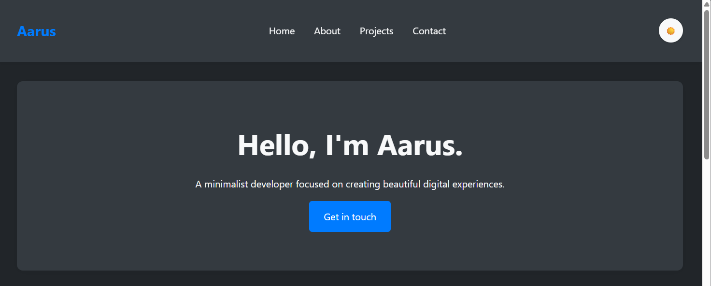
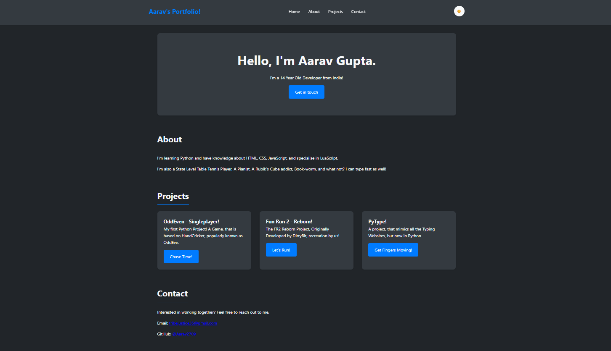
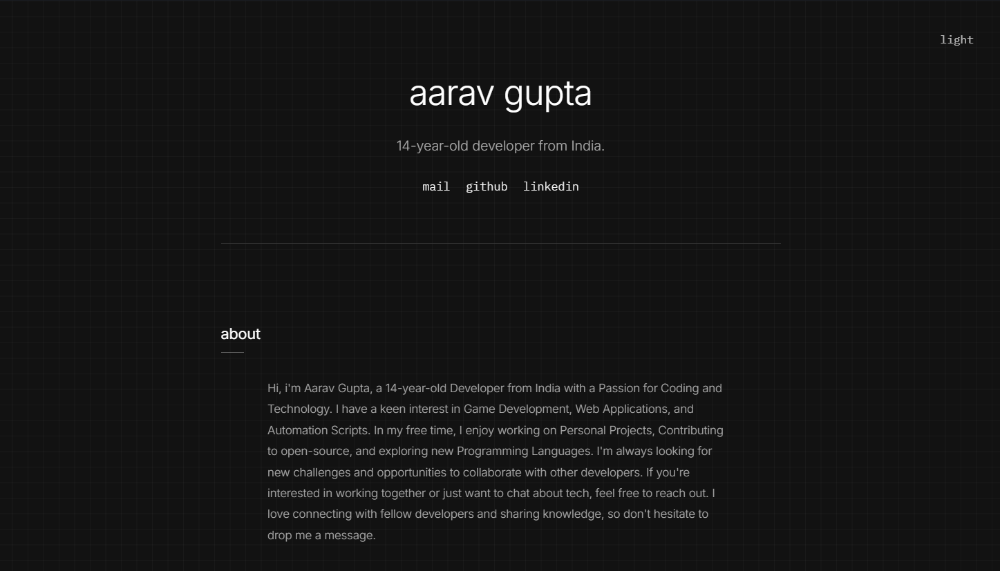
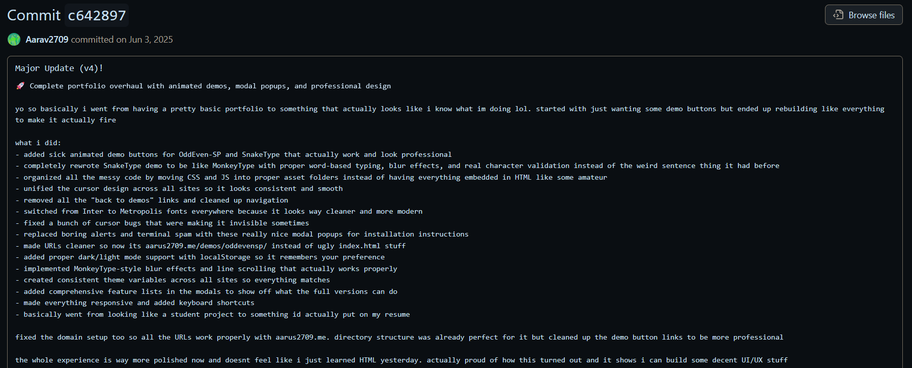
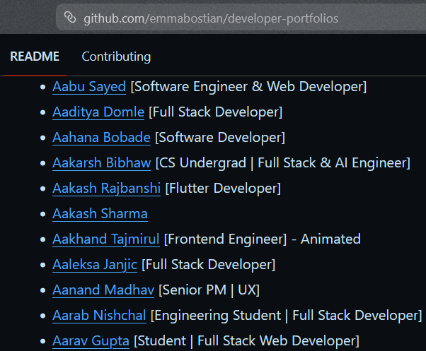
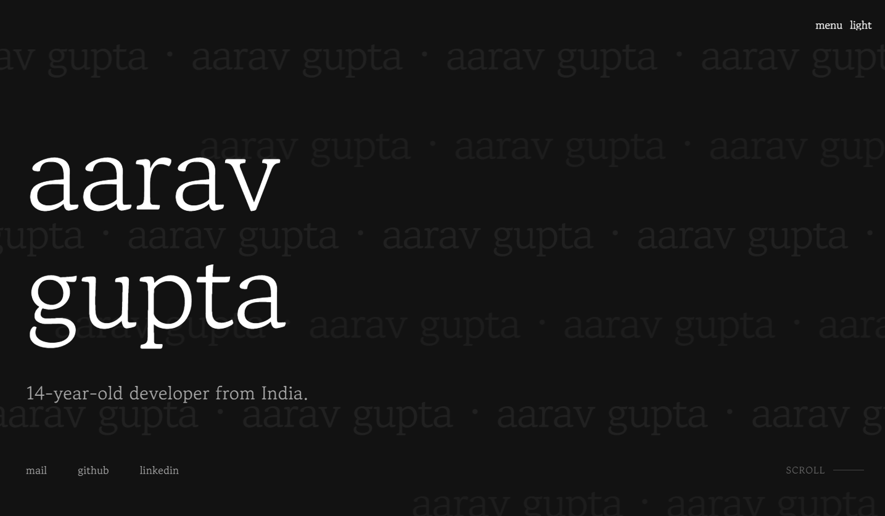
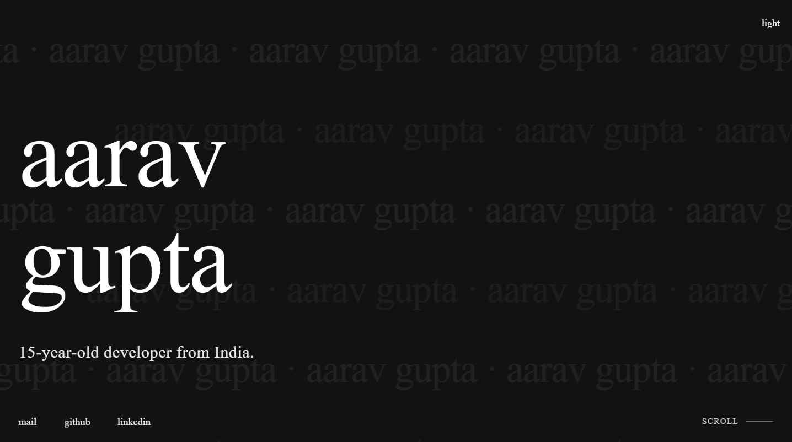
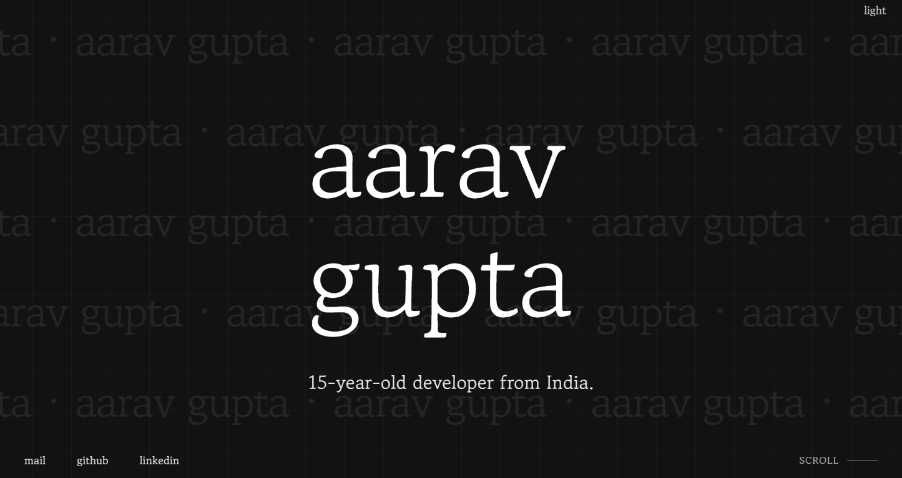
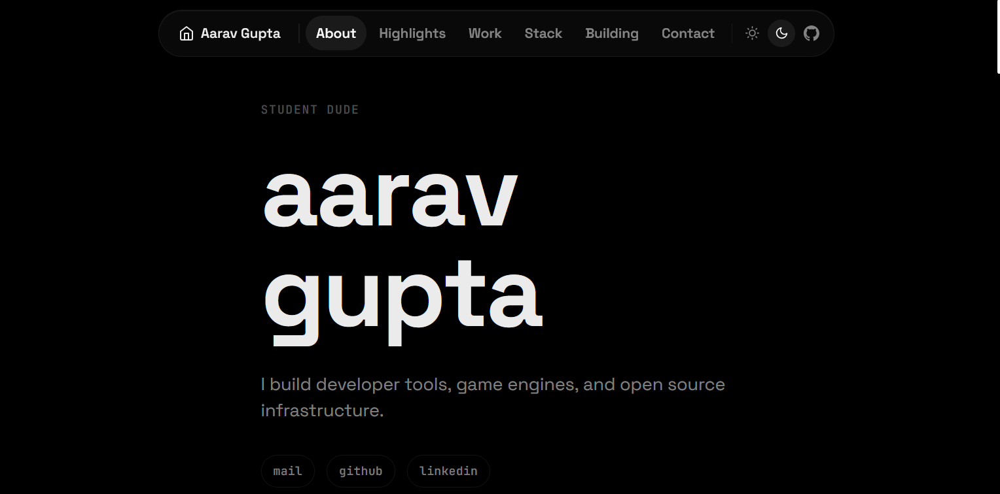
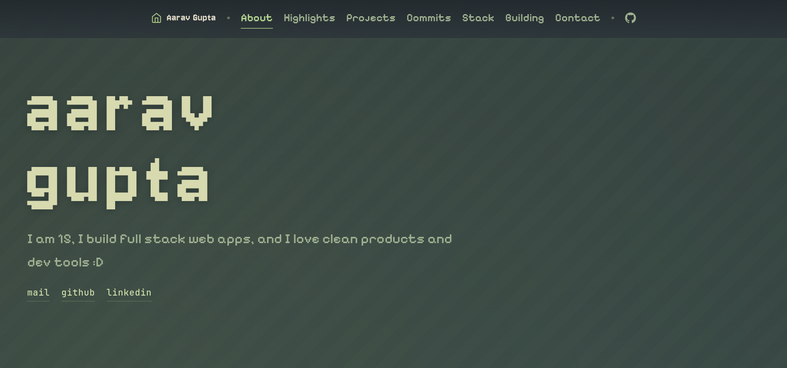

## Why make own and not choose templates?
This is my first ever blog, and it's the story of how my portfolio was built, from the very first draft to what you're looking at now. It's a long one, so get comfortable. Enjoy!

The main idea behind my portfolio was not to use any template, but instead, make my portfolio so good that people get inspired and use it as a template. I wanted to bring my own life into the portfolio rather than just using templates, because that felt easy and boring. Sounds bad, right?

---

## What to do after making a portfolio? What do I add?

This was one of the major questions in my mind, that if I'm making a portfolio, then why should I even make it?

My friends' portfolios were crazy at that time, so I decided to make my own, that's the first thing!

Then, while thinking of what to add and what not to add, I used their portfolios as references, brainstormed some ideas, and eventually came up with something that turned out to be great!

So I drafted some pointers initially, and they were:
1. A place where people can come and say, _"Ooh, this guy has done some crazy work."_
2. Tell the world about who I am and what I have done (projects? fyi: I had just one at that time xD!)
3. I had the domain from GitHub's education pack lying there, resting. Yes, I actually owned a [domain](https://aarus2709.me). I'm planning to get it back as soon as I start earning though.
4. And also, I was just 13 at that time, and I had great ideas, like, _"Let's go and earn some money!"_ I made a LinkedIn, posted my projects there, and then people approached me, told me to make a portfolio, so I asked them for advice, and they said, you gotta think about it yourself, just make sure to be **unique enough**.
5. That is still in my mind till this day when I'm revamping my portfolio as of now, and yeah, I am proud to say that my portfolio is very unique, and I'm happy with the way it turned out.

---

## Timeline

::::timeline
### May 2025, Initial Drafts
And thus, I made a new repo named ~~AarusPortfolio~~. Now that I'm broke, it's aarav2709.github.io xD!

As I was and am pretty good at web development, I decided to keep things not too tough, just Vanilla HTML, CSS and JS to start things up. With my first line being most of our first lines:
```html
<!DOCTYPE html>
```

You really wanna see how it turned out? Don't be surprised though.



Next day, I just changed the placeholders and called it a day. I was pretty darn happy with how the animations turned out to be. Removed the scrollbar too.



Then, I started working on it properly, and without a single commit for that entire week, I made it look very minimal and nice. It was honestly a big achievement for me. And I think you would agree too, how ugly it was compared to how it looked by 30th May, 2025.



Yeah, looks pretty nice, right? I really named the commit as `Last Update`; aka, yeah, I ain't switching to anything else anymore.

### June 2025, Major Updates Start Kicking In
Then! I started making some really nice updates to my portfolio. My friends started assisting me on what to do and what not, and their advice really helped shape the way my portfolio looks right now too!



:::margin
Mine is not up as of `30th July, 2026` because my domain is dead. Gonna get it back up there pretty soon.
:::

In the meantime, I got my portfolio listed on Emma Bostian's repo too! It is the most famous repo that lists developer portfolios.



Everything was going well, until I got bored of my existing portfolio, which is definitely a ***canon event.*** So I eventually started looking into the list where my portfolio was listed, and I got a LOT of ideas, and I was pretty astonished with how far ahead some people were compared to me. And I took ideas from around 100s of portfolios, wrote them down into one short note, and finally, began working on it. The first question that came to my mind was:
> What stack do I use?! Because the stack I had at that time made it kinda harder to recreate some of the portfolios I was inspired by.

So I decided to stick on HTML, CSS and JS, but with GSAP. Yes, my new stack was just GSAP added to the vanilla. I went down the rabbit hole, understanding how GSAP works, seeing open-source websites, trying to understand their implementations, and recreating those ideas myself. Kinda hard, but it was definitely fun!

### August 2025, Ground-up Rewrite

Yes, I had done some updates in August which just made my code better, and much-much more flexible, the only thing I was aiming for:
- [ ] Not an entire new stack.
- [x] An entire rewrite while sticking to the same stack, with a touch of GSAP.

While I was doing research and commits simultaneously, I also shifted my entire focus to rewrite, and I came out with this -



Pretty impressive, isn't it? Well I was too happy with what it was, and let it be.

Then, I wanted a reality check, so I asked my friends, dude, where do I put my portfolio so it gains traction quickly and I get rated on what is good and what is not?

The answer, as you might have guessed, was **Reddit!**

And yeah, I really got a reality check. There were lots and LOTS of flaws in my portfolio, and when I looked at it closer, I realized, oh yeah, it definitely is bad.

That's where most of my time was spent on!

### October 2025, Optimizations, Fixing Bugs, Better UX

This month was all about fixing the bugs, optimizing my website, and maximizing user experience. Because that's where the real thing happens.

Here's how I did everything this month:
- Optimization:
  - Learnt more about PageSpeed Insights and Concepts such as:
    - First Contentful Paint
    - Largest Contentful Paint
    - Total Blocking Time
    - Cumulative Layout Shift
    - Speed Index
  - Learnt about SEO and parts like `robots.txt` and `sitemap.xml`!
- Fixing Bugs:
  - Removing sidebar
  - Adding in-built features like a topbar instead
  - Transitions not triggering at the right time
  - and more...
- UX:
  - Remove preloader (for impatient people)
  - Spending time on rewriting layout
  - Removing unnecessary things which no one cared about



### November 2025, Surprise!

VERY VERY weird, but I never told my friends that I'm gonna change my stack very very soon, and that I learnt Astro, and my very brand new portfolio is being re-written in that.

```diff
- # Stack: HTML, CSS, JS and GSAP
+ # Stack: Astro
  Sneak peek of the README.md at that time.
```

Welp, things went nicely, and after almost 7 months of being tech-limited, I finally shifted to a tech stack, that really gave me that power, and I can still make the most use out of it to this date.

At the time of writing xD! It took me around 2 months, I had no commits regarding Astro too, because I was *replicating* my design in that, while fixing the stuff which people told me to fix and maintaining that level. It honestly wasn't that hard.



I started experimenting with GitHub's API and I learnt how to implement it into my portfolio, and it was pretty useful for me. Kinda fun.

In the meantime, I started working on my portfolio again, and the next major update being: entire design update!

As you all might have realized that this design was in use for over a year, I decided to make it better, and it turned out to be much, much nicer!

### March 2026, Design Update

Now that I had the advantages of Astro, it was too easy for me to make changes without getting limited by the tech stack I had.

Between December 2025 to February 2026, I was learning Zola. Yes, I was almost about to make the switch to it, but then I realized, no, I have spent a lot of time on Astro and I think I can remake the portfolio I wanted to in Astro itself.

And I wasn't wrong. I got inspired by Ametrine and Duckquill, and I really made that, in **Aaru's Style** xD!

The November version was mainly a migration to Astro, while this update was focused on redesigning the entire experience and making it feel more like my own.



### April 2026, A Twist of Mine

In the very beginning, I said, why not use templates, and make my own portfolio? With the March 2026 Version, I felt like I have violated the rule. Thus, I came back to what I stood on.

Thus, I just made some minor changes, such as new Font, new Theme, and that's it. Made it mobile responsive as well while preserving the performance too.



### July 2026, Gotta Last Forever.

Writing this at the time of testing my portfolio with not so many major changes. I think this is gonna be the one which will hopefully last forever.
::::

## Summary

| Month, Year | What changed? |
| :-- | :-- |
| May 2025 | Created the first version of my portfolio using Vanilla HTML, CSS, and JS. Started with a simple design and experimented with animations and layouts. |
| June 2025 | Improved the design, got feedback from friends, and started researching other developer portfolios. My portfolio was also listed on Emma Bostian's developer portfolio list. |
| August 2025 | Completely rewrote the portfolio while keeping the same stack, but added GSAP for advanced animations and better interactions. |
| October 2025 | Focused on optimization, UX improvements, bug fixes, SEO, and improving overall website performance. |
| November 2025 | Migrated the entire portfolio from Vanilla HTML/CSS/JS + GSAP to Astro, making the codebase cleaner, faster, and easier to maintain. |
| March 2026 | Created a completely redesigned Astro version inspired by portfolios like Amertrine and Duckquill, while adapting everything into my own style. |
| April 2026 | Added my own identity back into the portfolio with a new theme, improved fonts, and mobile responsiveness while keeping the performance intact. |
| July 2026 | Started another major revamp focusing on better structure, separate pages, improved project presentation, and integrating the blog system. |

## What I learned

Looking back, the biggest thing I learned was that a portfolio is never really finished. Every version taught me something new, whether it was design, performance, UX, or even writing better code.

The biggest improvement wasn't switching frameworks. It was understanding why I was making those changes.

## Well, that's it.

Never knew writing blogs could be this fun too! I hope you did enjoy reading this, though even with Typing Speed of around 150WPM, this still took me 2 hours to write since you know, we need THOSE EMOTIONS, lol. Anyways, enjoy your day, love you all!
